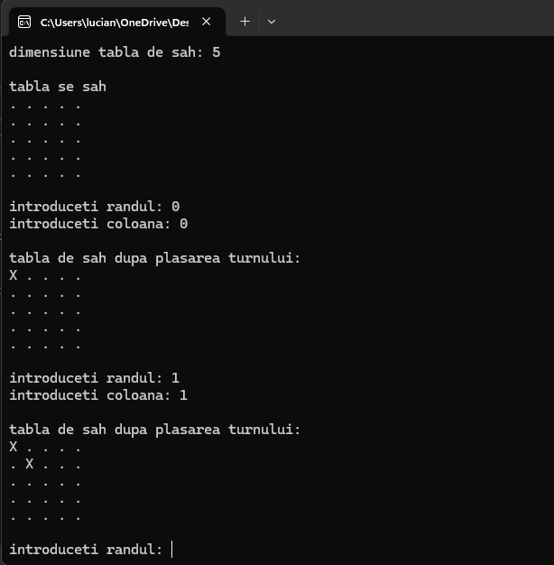

### **Problema celor 8 Turnuri**

#### **Descrierea Problemei**
Problema celor 8 turnuri presupune plasarea a 8 turnuri pe o tablă de șah astfel încât niciunul dintre ele să nu se atace reciproc. În contextul regulilor de șah, un turn poate ataca orice altă piesă aflată pe aceeași linie sau coloană. Soluția presupune identificarea tuturor configurațiilor posibile care respectă aceste condiții.

---

### **Detalii despre Implementare**

1. **Limbajul utilizat**: C++.
2. **Algoritmul folosit**: 
   - **Backtracking**: Permite explorarea tuturor combinațiilor posibile de poziționare a turnurilor.
   - **Validare poziții**: Se verifică pentru fiecare turn plasat dacă poziția sa este validă, adică nu există un alt turn pe aceeași coloană.
3. **Structura principală a programului**:
   - **Funcții utilizate**:
     - `afisareBoard`: Afișează configurația curentă a tablei.
     - `verificare`: Verifică dacă o poziție este validă pentru plasarea unui turn.
     - `solutiecompleta`: Verifică dacă toate cele 8 turnuri au fost plasate.
     - `backtrack`: Găsește toate soluțiile posibile utilizând recursivitate.

---

### **Platformă Software Utilizată**

1. **Limbaj de programare**: C++.
2. **Compilator**: 
   - GCC (Linux/macOS).
   - MinGW sau MSVC (Windows).
3. **Mediu de rulare**: Orice sistem de operare compatibil cu C++.

---

### **Rezultate**

1. **Plasare manuală**:
   - Utilizatorul poate plasa turnuri pe tablă, introducând coordonatele lor. Programul validează fiecare poziție introdusă.
   - După fiecare plasare, tabla de șah este actualizată și afișată.

2. **Generare soluții**:
   - Programul calculează și afișează toate configurațiile valide pentru plasarea celor 8 turnuri pe tablă.
   - Configurațiile sunt afișate sub forma unei reprezentări grafice (`X` pentru turnuri, `.` pentru spații goale).

3. **Număr total de soluții**:
   - Programul calculează numărul total de soluții valide și afișează acest rezultat.

---

### **Modalitate de Rulare**

1. **Compilare**:
   - Folosiți un compilator compatibil cu C++ pentru a compila programul:
     ```bash
     g++ ProiectSincretic.cpp -o ProiectSincretc
     ```

2. **Executare**:
   - Rulați programul:
     ```bash
     ./ProiectSincretic
     ```

3. **Interacțiune cu utilizatorul**:
   - Introduceți dimensiunea tablei de șah.
   - Plasați manual turnuri, specificând linia și coloana. Dacă doriți să opriți plasarea, introduceți `-1`.
   
   - Programul va afișa soluțiile găsite automat după validarea pozițiilor curente.

---

### **Observații**

- **Complexitate**: Backtracking-ul este eficient pentru dimensiunea standard de 8x8, dar poate deveni mai lent pentru dimensiuni mai mari.
- **Limitări**:
   - Dimensiunea minimă a tablei pentru care există soluții este `3x3`.
   - Performanța poate scădea pentru valori mari ale dimensiunii tablei (ex. `n > 15`).
